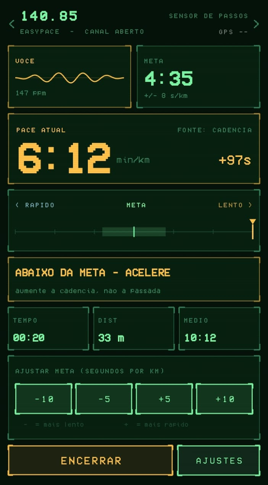

<div align="center">

# EasyPace

**Treinador de pace que fala pelo fone — com a estética do codec de Metal Gear Solid.**

Você define um ritmo. O app ouve os sensores e avisa por bipes quando você
acelera, quando cai, e quando está no ponto. Sem tirar o celular do bolso.

[](#)
[](#)
[](#)
[](LICENSE)



</div>

## Os três sons

| situação | som | cadência |
|---|---|---|
| **acima** da meta — você acelerou | bipe agudo duplo, subindo | ao entrar, e a cada 4 s |
| **dentro** da tolerância | chamada de codec: dois toques, duas vezes | ao entrar, e a cada **10 s** |
| **abaixo** da meta — o ritmo caiu | bipe grave, descendo | ao entrar, e a cada 4 s |

Nenhum arquivo de áudio: os bipes são sintetizados em tempo real com
`AudioTrack`, o que deixa o APK pequeno e a latência mínima. Saem no canal de
**mídia**, então tocam por cima da sua música e não são cortados pelo Não
Perturbe.

> Prefere o contrário? **AJUSTES → inverter agudo/grave**, sem recompilar.

## Instalar

Ainda não há release publicado — compile você mesmo. Precisa do **Android
Studio** instalado (ele traz o JDK e o SDK). No Prompt de Comando, dentro da
pasta do projeto:

```bat
build.bat keystore    :: cria sua chave de assinatura (uma vez só)
build.bat apk         :: gera o APK assinado em dist\
```

Copie o `.apk` para o celular e toque nele. **Depuração USB não é necessária.**

<details>
<summary><b>Instalar no celular sem cabo de depuração</b></summary>

1. Leve o `.apk` de `dist\` para o celular — cabo USB no modo "Transferência de
   arquivos", Google Drive, WhatsApp para você mesmo, e-mail, tanto faz.
2. No celular, abra o arquivo (em Downloads ou Meus Arquivos).
3. O Android avisa que a fonte é desconhecida: toque em **Configurações** e
   permita a instalação para o app que abriu o APK. É por app, e só uma vez.
4. Toque em **Instalar**. Se o Play Protect reclamar, escolha **Instalar mesmo
   assim** — o aviso aparece só porque o app não veio da Play Store.

</details>

<details>
<summary><b>Deu <code>[X] Nenhum JDK compatível encontrado</code>?</b></summary>

```bat
build.bat jdk         :: baixa um JDK 21 para tools\jdk21 (~190 MB, uma vez)
```

Isso acontece quando o Java que vem dentro do Android Studio é mais novo que o
**Java 23**. O Gradle 8.11 e o plugin Android 8.7 usados aqui não reconhecem
versões acima disso, e o build morre com uma mensagem que é só o número da
versão — algo como `25.0.2`, sem nenhuma explicação. O `build.bat jdk` instala
um JDK 21 dentro da pasta do projeto, sem tocar no Android Studio nem no Java
do sistema.

</details>

<details>
<summary><b>Todos os comandos do <code>build.bat</code></b></summary>

| comando | o que faz |
|---|---|
| `build.bat` | APK de teste (debug), sem precisar de chave |
| `build.bat apk` | APK final assinado em `dist\` |
| `build.bat keystore` | cria sua chave de assinatura (uma vez só) |
| `build.bat jdk` | baixa um JDK 21 compatível |
| `build.bat bump` | soma 1 no `versionCode` |
| `build.bat test` | roda os testes automatizados |
| `build.bat lint` | análise estática do Android |
| `build.bat reset` | mata daemons e limpa caches do Gradle |
| `build.bat diag` | build verboso + log real do daemon |
| `build.bat clean` | apaga tudo que foi compilado |
| `build.bat install` | instala pelo cabo (esse precisa de depuração USB) |

O script acha sozinho o JDK e o Android SDK, escreve o `local.properties`,
baixa o `gradle-wrapper.jar` se faltar, e nomeia o APK com versão e data.

</details>

## Usar

1. Toque em **CONCEDER PERMISSÕES** — localização, atividade física, notificações.
2. Ajuste a meta com `-10 / -5 / +5 / +10` (segundos por km).
3. **INICIAR**. O app calibra por ~8 s e começa a avisar.
4. Pode apagar a tela e guardar o celular. O monitor roda num *foreground
   service*, e a notificação tem um botão **PARAR**.

## Como ele mede o pace

O GPS entrega só **uma leitura por segundo** — sozinho, avisaria tarde demais.
O EasyPace funde duas fontes: o **GPS** dá a velocidade verdadeira, e a
**cadência** (sensor de passos, ou picos do acelerômetro) reage em ~300 ms e
preenche o intervalo entre fixes. Enquanto você corre, o app compara as duas e
aprende o seu comprimento de passada — é isso que mantém a medição viva quando
o sinal cai. O motor recalcula tudo **20 vezes por segundo**.

Mas mostrar `1000 / velocidade agora` não funciona. Pace é uma hipérbole: o
mesmo errinho de velocidade vira um erro de pace muito maior quanto mais
devagar você vai. Correndo a 3,3 m/s, um erro de 0,1 m/s desloca o pace em
9 s/km; **andando** a 1,4 m/s, o mesmo erro desloca **51 s/km**. Duas defesas:
**mediana dos últimos 5 fixes** (contra os picos de multipath perto de prédios)
e uma **janela deslizante de 12 s** (pace = distância da janela ÷ tempo da
janela).

<details>
<summary><b>Quanto isso melhorou, em números</b></summary>

Simulação de corrida a 5:00/km, com ruído de GPS e um pico de multipath a cada
20 s:

| | desvio do pace | erro médio |
|---|---|---|
| sem mediana, sem janela | 15,2 s/km | −8,4 s/km |
| só mediana | 8,0 s/km | −1,0 s/km |
| só janela | 9,2 s/km | −13,9 s/km |
| **as duas (atual)** | **5,4 s/km** | **−1,0 s/km** |

Repare que a janela sozinha **piora** o viés: ela integra os picos em vez de
descartá-los. Só a mediana os remove. Andando a 12:00/km, o desvio cai de
53 s/km para 24 s/km.

O custo é atraso: a janela de 12 s reconhece uma mudança real de ritmo em ~9 s
(com 8 s seriam 7 s; com 20 s, 12 s). Ajustável em **AJUSTES → janela do pace**.

A tela também é redesenhada só 4x por segundo, embora o motor continue em
20 Hz — um dígito trocando vinte vezes por segundo parece instável mesmo com a
medição boa.

Contra alternância na fronteira da meta há três amortecedores: **banda morta**
(±8 s/km), **histerese** (sair exige mais do que voltar) e **tempo mínimo de
confirmação** (2,5 s).

</details>

A matemática completa está em [`docs/ARQUITETURA.md`](docs/ARQUITETURA.md).

## Onde mexer

| quero mudar... | arquivo |
|---|---|
| tolerância, janela do pace, filtros, prazos dos bipes | `core/Config.kt` |
| o desenho dos sons (frequências, duração, timbre) | `audio/CodecSounds.kt` |
| quando cada som toca | `audio/AlertPolicy.kt` |
| a lógica de pace e a máquina de estados | `core/PaceEngine.kt` |
| cores e fontes | `ui/theme/CodecTheme.kt` |
| o layout da tela | `ui/CodecScreen.kt` |
| molduras, scanlines, botões | `ui/components/CodecUi.kt` |
| ícone | `res/drawable/ic_launcher_foreground.xml` |

`build.bat test` roda testes de JVM (sem celular) que simulam uma corrida
inteira com relógio falso: reconhecimento do ritmo, alertas nos dois sentidos,
histerese, integração de distância, cadência sem GPS, estabilidade do pace sob
ruído, e a política de repetição dos sons.

## Limitações conhecidas

- Precisa de **céu aberto** para o GPS. Em esteira o app cai no modo cadência,
  que depende do comprimento de passada aprendido — calibre uma vez na rua antes.
- Alguns fabricantes (Xiaomi, Samsung, Motorola) matam serviços em segundo
  plano. Se o app parar sozinho, tire o EasyPace da otimização de bateria.
- O APK de `release` só é assinado se existir um `keystore.properties`. Sem
  ele, o Android recusa a instalação.

<details>
<summary><b>O que fica fora do Git</b></summary>

O repositório tem só o código-fonte — cerca de 280 KB. Ficam de fora, por
`.gitignore`:

| não vai | por quê |
|---|---|
| `easypace.jks`, `keystore.properties` | a chave de assinatura e a senha dela |
| `local.properties` | tem o caminho do SDK com o nome de usuário da máquina |
| `dist/`, `build/`, `app/build/` | APKs e artefatos gerados |
| `tools/` | o JDK de ~330 MB baixado pelo `build.bat` |
| `.gradle/`, `.kotlin/`, `.idea/` | caches de ferramenta e config de IDE |

**A chave de assinatura nunca deve ser versionada.** Ela *é* a identidade do
app: quem a tiver pode publicar atualizações que o Android aceita como suas. Se
vazar num commit, apagar o arquivo depois não resolve — o conteúdo continua no
histórico, e o certo é gerar uma chave nova.

Quem clonar consegue compilar: `build.bat` recria o `local.properties` a partir
do SDK da máquina, e cada pessoa cria a **própria** chave com
`build.bat keystore` (o formato está em `keystore.properties.example`).

O `.gitattributes` fixa os finais de linha: `.bat` sempre CRLF (senão o
`cmd.exe` engasga) e `gradlew` sempre LF (senão não roda em Linux/macOS).

</details>

## Licença

[MIT](LICENSE) — use, modifique e distribua à vontade.
